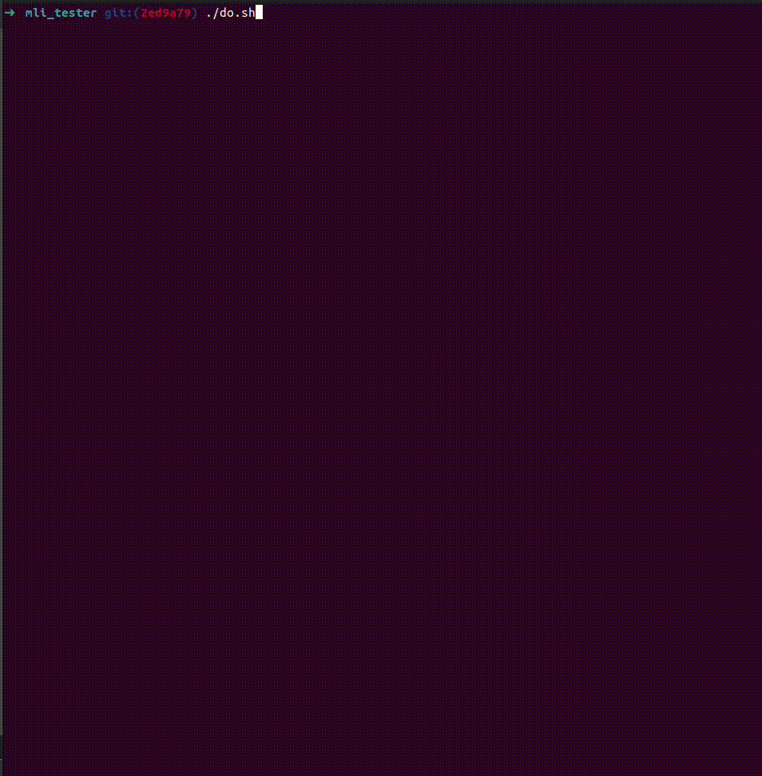

# 42_container

C++ language
A Stack, map and vector reimplementation project.

<p align="left"> *************************** ENGLISH *************************** </p>

## Prerequisites
* A Unix-based operating system (for example: Linux, macOS)
* GCC compiler
* GNU Make


## How to make the exercises work 
``` git clone "git@github.com:olelong/42_container.git" ```

``` cd my_repo_git_name ```

Run the ``` make ``` command to run only my ft_container.

Then launch the executable ``` ./ft_containers ```.  

##### OR

Run the ``` make real ``` command to run only the stl container.

Then launch the executable ``` ./real ```.  

##### OR

Run the ``` make test ``` command to run both and see the difference beteween them.
It is normal that the max size is different between the one of my container and the one of the stl.

-> You can test differents mains, you just need to change PATH in the makefile:

``` SRCS_DIR	= mains/mine/ ```

``` SRCS		= main_map.cpp ```

</br></br>

### Stack :

Implement a Stack class taking in parameter of its template our Vector class by default.

#### The specificities of this container :

```

  - It works like a stack of plates where you can only remove the one on top.
   
  - To access the elements of the stack, you must always access them from the last one.
    
  - It cannot be iterated.

```

#### Its functions :

empty():	Boolean, returns if the stack is empty (if its size is null).

size():		Returns the number of elements in the stack.

top():		Returns a reference to the top element of the stack. The element
		top is the last element inserted in the stack.
      
push(): 	Inserts a new element at the top of the stack, on top of its current
		top element. The content of this new element is a
		copy of val.
      
pop():  	Deletes the top element, reducing its size by 1.


#### Example of using Stack :

```cpp

int main() {
	stack<float> lhs; // Create a stack
	lhs.push(12); // Add an element to the stack
	lhs.pop(); // Delete the last added element
	
	std::cout << "size of lhs: " << lhs.size() << std::endl; // We display the size of our stack
	for (int i = 0; i < 5; i++) // We add to the stack n elements (here 5)
	{
		mystack.push(i); // We add i
		// We display i and we display the last element with top() to check that it is the same one:
		std::cout << "i: " << i << std::endl;
		std::cout << "top(): " << mystack.top() << std::endl;
	}
}
	
```

</br></br>

### Vector:

Vector is a kind of dynamic array that can change its size.

#### The specificities of this container :

	- It can change size dynamically.
	
	- It uses a dynamic allocation to store its elements, that is to say that it has a defined capacity
	
	  and that it doesn't reallocate at each insertion of a new element but rather when this capacity is exceeded.
	  
	- Can be iterated with iterator and reverse_iterator.
	

#### Its main functions:

##### Iterators :

Begin():	Return an iterator on the beginning of the vector.

Rbegin():	Returns an iterator on the inverse of the beginning of the vector.

End():		Returns an iterator on the end of the vector.

Rend():		Returns an iterator on the inverse of the end of the vector.


##### Capacity :

size(), resize(), capacity() : Allow to manage and know the capacity or the size.

##### Element access :

operator[], at(), front(), back(): These are functions that allow to access elements of the array.

##### Modifiers :

assign(), push_back(), pop_back(), insert(), erase(), swap(), clear(): Allow to manage the elements of the array.

They will either add/insert one or more elements or delete, swap some...


#### Example of using Vector :

```cpp

int main() {
	vector<std::string> vect(1, "ok"); // We create a vector vect which will contain std::string
	vect.push_back("a"); // Add elements to it
	vect.push_back("b");
	vect.push_back("c");

	std::cout << vect.size(); // We display the size of the vector 
	std::cout << vect.capacity(); // Display its capacity
	
	vect.assign(5, 12); // We assign to our vector 5 times the value 12
	// We display the content of our vector:
	for (vector<int>::iterator it = vect.begin(); it != vect.end(); it++)
		std::cout << *it << " ";
	
	vector<int>::iterator itie; // We create a vector iterator
	itie = vect.begin(); // We put our new iterator at the position of the vector begin
	vect.erase(itie + 1); // We erase in our vector the element at the position begin + 1
}

```

</br></br>

### Map:

Map is a set of container that will store the elements formed by a combination between a key and a value.

#### The specificities of this container:

	- The key allows to sort and identify the elements. 
	- The types can be different between a key and its value.
	- We create a pair.

#### Binary trees:

<p>/******Simple binary tree without sorting and unbalanced:******/</p>

example:

```

		            42
			  / \
                        40 45
			/\ / \
		       38 41 43 47
		      / \ \
		     37 44 49
	                / \
                       48 55

```

Here, 42 is the root. 41 is its left child because it is smaller and 45 its right child.
42 is therefore the parent of 41 and 45.

If we delete 40, 38 will only take the place of 40.

If we delete 49, it is 48 which takes its place.

If we delete 48, nothing special happens.

If we delete 42, 41 will be the one to go up and take the place of 42.

If we want to add for example 44, it will arrive as the right child of 43.


<p>/**************** Binary tree: AVL ******************/</p>

Vocabulary:

Balance factor: The difference between the height of the left subtree of the factor - the height of the subtree
(height left - height right).

Factor: Each node has a balance factor and it must be between -1 and 1 if it is not the case the tree is not balanced. 

Example of tree :

```

                       (33)
                       / \
                    (9) (53)
                  / \     \
               (8) (21)   (61)
                           /
                         (11)

```

Result of the equilibrium factors of this tree: 

```

                          1
                         / \
                       -1 -1
                       / \ \
                       0 1 0
                        /
                       0

```

33 : height left 3 - height right 2 = 1 
9 : height left 1 - height right 2 = -1
61 : height left 0 - height right 0 = 0 

Height : the longest left or right following each other. 

##### Rotation subtrees:

The position between nodes is interchanged, there are two types of rotation: left and right.

Left rotation: 	Arrangements on the right nodes are transformed into arrangements on the left node.

Right rotation: The opposite of left rotation.

Left-right rotation: left then right rotation.

Right-left rotation: right then left rotation.

Example of left rotation:

1. Initial tree: 

```

       P 
      /
     (X)  
    / \
   A (Y)
     / \
     B Z
   
```

2. If y has a left subtree, we assign x as parent of the left subtree of y: 

```

       P 
      /
     (X)  
    / \
   A   B        (Y)
                 \
                  Z

```

3. If the parent of x is NULL, we put y as root of the tree.
4. If x is the left child of p, make y the left child of p.
5. Otherwise assign y as the right child of p:

```

     (X)       P
    / \        \
   A   B       (Y)
                 \
                  Z

```

6. Make y the parent of x:

```

               P
               \
               (Y)
              / \
             (X) Z
            / \
           A   B

```

Other possible actions:
Insert/Delete/find


Other existing binary tree:

Red black tree :

Binary tree balanced between red and black nodes and following strict rules.

#### Example of map use :

```cpp

int main() {
	map<char, int> m; // We create a map named m which will have a char as key and an int as value 
	m['d'] = 4; // We add a pair manually
	m['c'] = 99;

	m.insert(make_pair('r', 7)); // We insert an element by creating a new pair
	// We display the content of our map:
	std::cout << "map print after insertion: { ";
	for (map<char, int>::iterator it = m.begin(); it != m.end(); it++)
		std::cout << it->first << " " << it->second << "; ";
	
	m.erase('p'); // We delete the pair whose key is 'p'
}

```

</br></br>

### Others:

-> iterator_traits: is a way to retrieve information of an iterator.

-> enable_if : allows to allow or forbid some (conditional) overloads at compile time.

It is a metafunction*, in fact the result of this function is obtained and interpreted at compilation (and not at runtime).

*a metafunction is a struct.

-> is_integral : test if the class passed in parameter is an integer (its value attribute is set to true).

-> equal : test if a range (from first1 to last1) is equal to another range (from first2).

-> lexicographical_compare : compares range1 and range2, if range2 is smaller or if the first element is not equal to range1 and 

equal to range1 and it is smaller, it is false and vice versa.

-> pair and make_pair: work with map. They allow to manage and create pairs.

## Example of results with the tester made by the student of 42 @mli:

<div align="center">
  
</div>

## License

This project is licensed under the MIT License - see the [LICENSE](LICENSE) file for details.

</br></br></br></br>
<p align="left"> *************************** FRANCAIS *************************** </p>

Le but du projet est d'implémenter les containers Stack, map and vector.

## Prérequis
* Un système d'exploitation basé sur Unix (par exemple: Linux, macOS)
* Un compilateur GCC
* Un GNU Make

## Comment lancer le programme :

``` git clone "git@github.com:olelong/42_container.git" ```

``` cd my_repo_git_name ```

Lancez la commande ``` make ``` pour lancer seulement mon ft_container.

Ensuite lance l'exécutable ``` ./ft_containers ```.

##### 		OU
Lancez la commande ``` make real ``` pour lancer le container de la stl.

Ensuite lance l'exécutable ``` ./real ```.  

##### 		OU
Lancez la commande ``` make test ``` pour compiler les deux containers et faire un make diff des deux.

-> Tu peux tester différents mains, en changeant le PATH dans le makefile:

``` SRCS_DIR	= mains/mine/ ```

``` SRCS		= main_map.cpp ```

</br></br>

### Stack :

Implémenter une classe Stack prenant en paramètre de son template notre classe Vector par défaut.

#### Les spécificités de ce container :

```

  - Elle fonctionne comme une pile d'assiette dans laquelle on ne peut retirer que celle qui est posé sur le dessus.
    Pour accéder aux éléments de la pile, il faut toujours y accéder depuis le dernier.
  - Elle ne peut pas être itérer.

```

#### Ses fonctions :

empty():	Booléen, retourne vraie si la pile est vide(si sa taille est nulle).

size():		Renvoie le nombre d'éléments dans la pile.

top():		Renvoie une référence a l'élément sommet de la pile. L'élément sommet est le dernier élément inséré dans la pile.
      
push(): 	Insére un nouvel élément au sommet de la pile, au dessus de son	élément sommet actuel. 
		Le contenu de ce nouvel élément est une copie de val.
      
pop():  	Supprime l'élément sommet, réduisant ainsi sa taille de 1.

#### Exemple d'utilisation de Stack :

```cpp

int main() {
	stack<float> lhs; 	// On crée une stack
	lhs.push(12); 		// On ajoute a la stack un élément
	lhs.pop(); 		// On supprime le dernier élément ajouté
	
	std::cout << "size of lhs: " << lhs.size() << std::endl; // On affiche la taille de notre stack
	for (int i = 0; i < 5; i++) // On ajoute a la stack n éléments (ici 5)
	{
		mystack.push(i); // On ajoute i
		// On affiche i et on affiche le dernier élément avec top() pour vérifier que c'est bien le même:
		std::cout << "i: " << i  << std::endl;
		std::cout << "top(): " << mystack.top() << std::endl;
	}
}

```

</br></br>

### Vector :

Vector est une sorte de tableau dynamique qui peut changer de taille.

#### Les spécificités de ce container :

	- Il peut changer de taille de façon dynamique.
	- Il utilise une allocation dynamique pour stocker ses éléments, c'est à dire qu'il a une capacité définie
	et qu'il ne réalloue pas a chaque insertion d'un nouvel élément mais plutôt lorsque cette capacité est dépassé.
	- Peut être itéré avec iterator et reverse_iterator.

#### Ses fonctions principales :

##### Iterateurs :

Begin():	Retourne un itérateur sur le début du vector.

Rbegin():	Retourne un itérateur sur l'inverse du début du vector.

End():		Retourne un itérateur sur la fin du vector.

Rend():		Retourne un itérateur sur l'inverse de la fin du vector.


##### Capacity :

size(), resize(), capacity() : Permettent de gérer et connaitre la capacité ou la size.

##### Element access :

operateur[], at(), front(), back() : Ce sont des fonctions qui permettent d'accéder a des éléments du tableau.

##### Modifiers :

assign(), push_back(), pop_back(), insert(), erase(), swap(), clear() : Permettent de gérer les éléments du tableau.

Ils vont soit ajouter/inserer un ou des élément.s ou en supprimer, en échanger...


#### Exemple d'utilisation de Vector :

```cpp

int main() {
	vector<std::string> vect(1, "ok"); 	// On crée un vector vect qui contiendra des std::string
	vect.push_back("a");			// On lui ajoute des éléments
	vect.push_back("b");
	vect.push_back("c");

	std::cout << vect.size();		// On affiche la taille du vecteur 
	std::cout << vect.capacity();		// On affiche sa capacité
	
	vect.assign(5, 12);			// On assigne a notre vector 5 fois la valeur 12
	// On affiche le contenu de notre vector:
	for (vector<int>::iterator it = vect.begin(); it != vect.end(); it++)
		std::cout << *it << " ";
	
	vector<int>::iterator itie;		// On créer un vector iterateur
	itie = vect.begin();			// On met notre nouvel itérateur a la position du begin du vector
	vect.erase(itie + 1);			// On erase dans notre vector l'élément a la position begin + 1
}

```

</br></br>

### Map :

Map est un ensemble de conteneur qui va stocker les éléments formés par une combinaison entre une clé et une valeur.

#### Les spécificités de ce container :

```

	- La clé permet de trier et d'identifier les éléments. 
	- Les types peuvent être différent entre une clé et sa valeur.
	- On créer une paire.

```

#### Les arbres binaires :

<p>/******Arbre binaire simple sans tri et non équilibré:******/</p>
exemple :

		            42
			  /    \
                        40      45
			/\	/  \
		       38 41   43   47
		      /		\     \
		     37		 44	 49
				        /  \
				       48   55

Ici, 42 est le root. 41 est son child de gauche car il est plus petit et 45 son child droit.
42 est donc le parent de 41 et 45.

Si on supprime 40, 38 va seulement prendre la place de 40.

Si on supprime 49, c'est 48 qui prend sa place.

Si on supprime 48, il ne se passe rien de special.

Si on supprime 42, 41 va être celui qui remontera et prendra la place de 42.

Si on veut ajouter par exemple 44, il arrivera en tant que child droit de 43.


<p>/****************  Binary tree : AVL  ******************/</p>

Vocabulaire :

(Facteur d’équilibre) Balance factor:	La différence entre la hauteur du subtree gauche du facteur - la hauteur du subtree
droit (height left - height right).

Subtree:	Sous arbre 

Facteur: 	Chaque node a un facteur d’équilibre et il doit être entre -1 et 1 si ce n’est pas le cas l’arbre n’es pas équilibré. 

Exemple d’arbre :

                            (33)
                       /           \
                    (9)           (53)
                  /      \           \
              (8)       (21)         (61)
                         /
                     (11)

Résultat des facteurs d’équilibre de cet arbre : 

                              1
                         /         \
                       -1           -1
                    /     \            \
                   0      1              0
                          /
                         0
		
33 : height left 3 - height right 2 = 1 
9 : height left 1 - height right 2 = -1
61 : height left 0 - height right 0 = 0 

Height : la plus longue de gauche ou de droite qui se suit. 

##### Rotation subtrees:

La position entre des nodes est interchangées, il existe deux type de rotations : left et right.

Left rotation: 	Les arrangements des noeuds de droite sont transformés en arrangements sur le noeud de gauche.

Right rotation: Contraire de left rotation.

Left-right rotation: left puis right rotation.

Right-left rotation: right puis left rotation.

Exemple de left rotation:

1. Initial tree: 

```

       P 
      /
     (X)  
    /   \
   A     (Y)
        /   \
       B     Z

```

2. Si y a un subtree gauche, on assigne x comme parent du subtree gauche de y: 

```

       P 
      /
     (X)  
    /   \
   A     B     (Y)
                 \
                  Z

```

3. Si le parent de x est NULL, on met y comme root de l’arbre.
4. Si x est le left child de p, faire de y le left child de p.
5. Sinon assigner y comme right child de p:

```

     (X)       P
    /   \      \
   A     B     (Y)
                 \
                  Z

```

6. Faire de y le parent de x:

```

               P
               \
               (Y)
              /   \
             (X)   Z
            /   \
           A     B

```

Autres Actions possibles :
Insert/Delete/find


Autre arbre binaire existant:

Red black tree :

Arbre binaire équilibré entre des nodes rouges et noires et suivant des règles strictes.

#### Exemple d'utilisation de map :

```cpp

int main() {
	map<char, int> m; 	// On créer une map nommee m qui aura un char comme key et un int comme value 
	m['d'] = 4;		// On ajoute une paire manuellement
	m['c'] = 99;

	m.insert(make_pair('r', 7));	// On insert un element en créant une nouvelle paire
	// On affiche le contenu de notre map:
	std::cout << "map print after insertion: { ";
	for (map<char, int>::iterator it = m.begin(); it != m.end(); it++)
		std::cout << it->first << " " << it->second << "; ";
	
	m.erase('p');		// On supprime la paire dont la clé est 'p'
}

```
</br></br>

### Autres :

-> iterator_traits : est un moyen de récupérer les informations
d'un itérateur.

-> enable_if : permet d'autoriser ou interdire certains overloads (de types) (conditionnels) a la compilation.

C'est une métafonction*, en effet le résultat de cette fonction est obtenu et interprété a

la compilation (et non a l'exécution).

*une métafonction est une struct.

-> is_integral : teste si la class passée en paramètre est un entier (son attribut value est set a true).

-> equal : teste si une range (de first1 a last1) est égale a une autre range (a partir de first2).

-> lexicographical_compare : compare range1 et range2, si range2 est plus petite ou si le premier élément n'est 

pas égal a range1 et qu'il est plus petit, c'est false et vice-versa.

-> pair et make_pair : fonctionnent avec map. Ils permettent de gérer et créer des paires.

## Exemple de résultats avec le testeur réalisé par l'étudiant de 42 @mli

<div align="center">
  
</div>

## Licence

Ce projet est sous licence MIT - voir le fichier [LICENSE](LICENSE) pour plus de détails.
